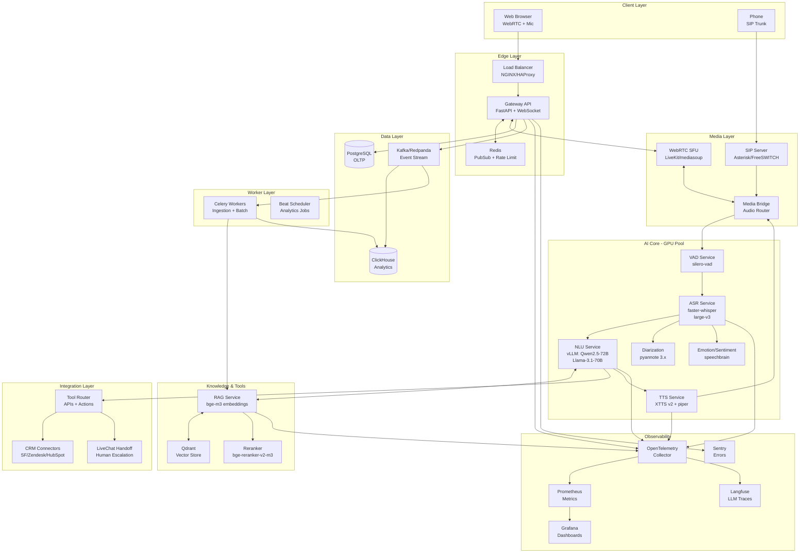
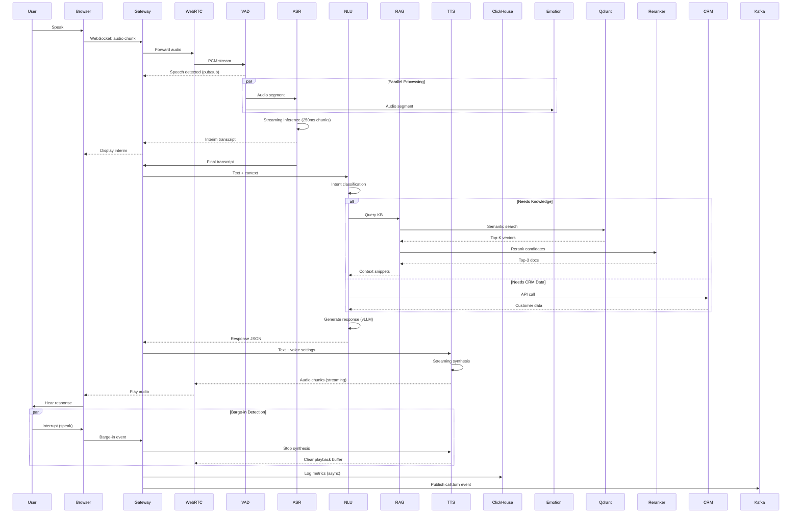
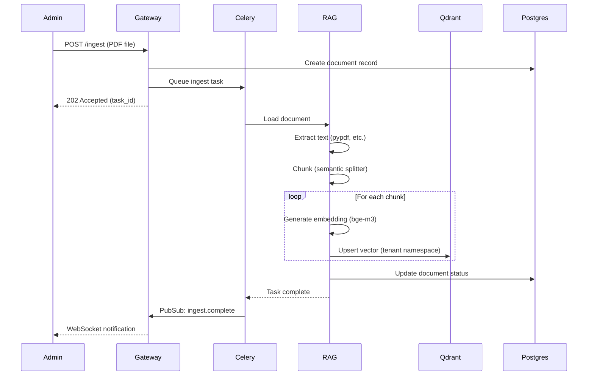
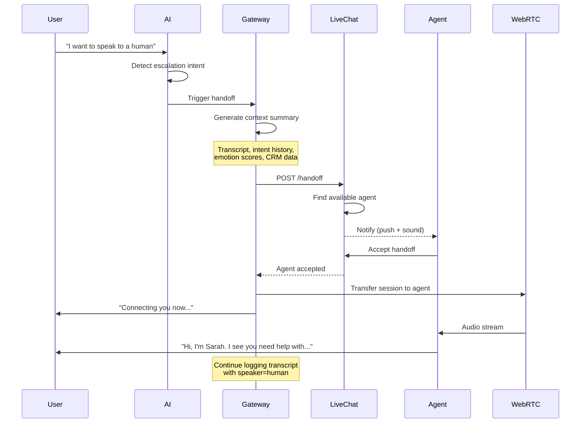

# Voice AI CX Platform Architecture

## TL;DR

A privacy-first, open-source Voice AI Customer Care platform built for UAE/MENA markets supporting real-time Arabic/English voice calls with sub-1.5s E2E latency. The system leverages Whisper-large-v3 for streaming ASR, Qwen2.5-72B/Llama-3.1-70B for reasoning, XTTS-v2 for expressive multilingual TTS, and integrates RAG (bge-m3 + Qdrant) for knowledge grounding. Architecture supports on-prem/VPC deployment with WebRTC+SIP channels, GPU-aware scaling, human handoff, CRM integration, and full observability (OpenTelemetry, Langfuse, Prometheus/Grafana).

---

## High-Level Architecture



---

## Detailed Component Architecture

### 1. Client Layer

#### Web Browser (WebRTC)
- **Tech**: JavaScript/TypeScript with WebRTC APIs
- **Features**:
  - Real-time audio streaming (Opus codec, 16kHz)
  - Microphone capture with noise suppression
  - Barge-in detection (stop playback on user speech)
  - Live transcript display
  - Connection state management
- **Latency**: < 50ms audio buffering

#### Phone (SIP)
- **Tech**: SIP trunks via Twilio/Plivo or direct carrier integration
- **Codecs**: G.711, Opus
- **Features**: DTMF, call transfer, recording

---

### 2. Edge Layer

#### Gateway API (FastAPI)
- **Ports**:
  - REST: 8000
  - WebSocket: 8000/ws
- **Responsibilities**:
  - JWT authentication & authorization
  - Rate limiting (per tenant, per user)
  - Session management (call state, context)
  - WebSocket upgrades for streaming
  - REST endpoints for ingestion, queries, handoff
- **Scale**: Stateless, horizontal autoscaling
- **Latency**: < 10ms per hop

#### Redis
- **Purpose**:
  - PubSub for inter-service events
  - Session state cache
  - Rate limit counters
  - Distributed locks
- **Config**: Redis Cluster for HA

---

### 3. Media Layer

#### WebRTC SFU (LiveKit/mediasoup)
- **Purpose**: Selective Forwarding Unit for multi-party calls
- **Features**:
  - ICE/STUN/TURN for NAT traversal
  - Bandwidth adaptation
  - Track subscription management
- **Deployment**: On-prem or VPC with UDP ports exposed
- **Latency**: < 100ms E2E (client to SFU)

#### SIP Server (Asterisk/FreeSWITCH)
- **Purpose**: PSTN gateway, IVR fallback
- **Integration**: Bridges to WebRTC via RTP/SRTP
- **Config**: Dial plans for routing to AI or human queues

#### Media Bridge
- **Purpose**: Audio router between WebRTC/SIP and AI services
- **Tech**: Custom Python/Go service with PyAudio or GStreamer
- **Features**:
  - PCM resampling to 16kHz mono
  - Stream multiplexing (send to VAD + ASR + Emotion in parallel)
  - Playback mixing (overlay TTS over hold music if needed)
- **Latency**: < 20ms processing

---

### 4. AI Core (GPU Pool)

#### VAD Service (silero-vad)
- **Purpose**: Voice Activity Detection for turn segmentation
- **Model**: Silero VAD v4 (ONNX)
- **Input**: 16kHz PCM chunks (512 samples = 32ms)
- **Output**: Speech probability [0-1]; threshold 0.5
- **Latency**: < 5ms per chunk (CPU-based)
- **Use**: Gate ASR streaming, detect user barge-in

#### ASR Service (faster-whisper)
- **Model**:
  - Primary: **Whisper large-v3** (1550M params)
  - Fallback: **distil-whisper-large-v3** for lower latency
- **Framework**: `faster-whisper` (CTranslate2)
- **Features**:
  - Streaming mode with chunked inference (250ms windows)
  - Language hints: `ar` (Arabic), `en` (English), auto-detect
  - Timestamp alignment for diarization
  - GPU: A10 (24GB) = 4 concurrent streams
- **Latency**:
  - Chunk: 250-300ms (on A10)
  - Full utterance: 800ms for 10s audio
- **Interface**: gRPC streaming

#### Diarization (pyannote.audio 3.x)
- **Purpose**: Speaker separation (user vs agent vs background)
- **Model**: `pyannote/speaker-diarization-3.1`
- **Mode**: Post-call batch (not real-time)
- **Use**: Analytics, compliance, transcript clarity
- **GPU**: 1GB VRAM per job

#### Emotion/Sentiment (speechbrain)
- **Purpose**: Paralinguistic analysis (anger, frustration, satisfaction)
- **Model**:
  - `speechbrain/emotion-recognition-wav2vec2-IEMOCAP`
  - Or custom `Emotion2Vec` fine-tuned for Arabic
- **Input**: 3-5s audio chunks
- **Output**: Emotion class + valence/arousal scores
- **Latency**: 50-100ms per chunk (GPU)
- **Use**: Real-time escalation triggers, post-call CSAT proxy

#### NLU Service (vLLM)
- **Model**:
  - Primary: **Qwen2.5-72B-Instruct** (Q4_K_M quant)
  - Alternative: **Llama-3.1-70B-Instruct**
- **Framework**: vLLM (PagedAttention, continuous batching)
- **Features**:
  - Structured outputs (JSON schema enforcement)
  - Tool-use protocol (function calling)
  - RAG-augmented prompts
  - Multi-turn context management (8K context)
  - Code-switching support (Arabic/English)
- **GPU**: 2x A100 (80GB) = 20-30 concurrent requests
- **Latency**:
  - TTFT: 200-400ms
  - Token generation: 40-60 tokens/s
  - Target: < 800ms for 20-token response
- **Interface**: gRPC + REST (OpenAI-compatible)

#### TTS Service (XTTS v2)
- **Model**: Coqui XTTS v2 (multilingual, expressive)
- **Voices**:
  - Arabic (Gulf): male/female presets
  - English (UAE accent): male/female
  - Custom voice cloning (13s sample)
- **Features**:
  - Streaming synthesis (chunk-by-chunk)
  - SSML-like controls: speed, energy, emotion
  - Prosody conditioning for politeness register
- **Fallback**: Piper TTS (ultra-low latency, less expressive)
- **GPU**: A10 (24GB) = 8 concurrent streams
- **Latency**:
  - First audio chunk: 400-600ms
  - Streaming: 100ms per chunk (250ms audio)
- **Interface**: gRPC streaming

---

### 5. Knowledge & Tools

#### RAG Service
- **Components**:
  1. **Ingestion Pipeline**:
     - Document loaders (PDF, DOCX, HTML, MD)
     - Chunking: semantic splitter (512 tokens, 128 overlap)
     - Metadata extraction (title, source, date, language)
  2. **Embedding**:
     - Model: **bge-m3** (multilingual, 1024-dim)
     - Batch size: 32
     - GPU: shared with reranker (4GB VRAM)
  3. **Indexing**:
     - Qdrant collections per tenant
     - HNSW index (ef_construct=128, m=16)
  4. **Retrieval**:
     - Hybrid: dense (cosine) + sparse (BM25)
     - Top-K: 20 candidates
  5. **Reranking**:
     - Model: **bge-reranker-v2-m3**
     - Cross-encoder scoring
     - Final top-3 results
- **Latency**:
  - Embed query: 10ms
  - Qdrant search: 20-50ms
  - Rerank: 100-150ms
  - Total: < 200ms
- **Interface**: REST

#### Qdrant
- **Config**:
  - Replicas: 3 (HA)
  - Storage: SSD-backed persistent volumes
  - Collections: multi-tenant namespaces
- **Scale**: 1M vectors = ~4GB RAM

---

### 6. Integration Layer

#### CRM Connectors
- **Supported**:
  - Salesforce (REST + Streaming API)
  - Zendesk (REST)
  - HubSpot (REST)
  - Freshdesk (REST)
- **Actions**:
  - Create/update tickets
  - Fetch customer history
  - Log interactions
  - Trigger workflows
- **Auth**: OAuth2 per tenant

#### LiveChat Handoff
- **Protocol**: REST webhooks + WebSocket
- **Flow**:
  1. AI detects escalation intent
  2. Create handoff request with context
  3. Notify human agent
  4. Transfer WebRTC/SIP session
  5. Post-call: merge AI + human transcripts
- **Context**:
  - Full transcript
  - Intent timeline
  - Emotion scores
  - CRM snapshot
  - Suggested actions

#### Tool Router
- **Purpose**: Execute LLM tool calls (function calling)
- **Registry**: Dynamic tool definitions (JSON schema)
- **Examples**:
  - `search_kb(query)` → RAG
  - `get_order_status(order_id)` → CRM
  - `escalate_to_human(reason)` → LiveChat
  - `send_sms(number, message)` → Twilio
- **Validation**: Pydantic schemas

---

### 7. Data Layer

#### PostgreSQL
- **Schema**:
  - `tenants` (multi-tenancy)
  - `users` (auth)
  - `calls` (sessions, state, metadata)
  - `transcripts` (turns, timestamps, speaker)
  - `actions` (tool calls, outcomes)
  - `kb_documents` (source tracking)
  - `configs` (policies, thresholds, voice settings)
- **Migrations**: Alembic
- **Backups**: pg_dump + WAL archiving

#### ClickHouse
- **Schema**:
  - `call_events` (streaming inserts)
    - timestamp, call_id, event_type, latency_ms, metadata
  - `metrics` (aggregated)
    - AHT, FCR, CSAT proxy, intents, emotion trends
- **Queries**: Real-time dashboards, funnel analysis
- **Retention**: 90 days raw, 1 year aggregates

#### Kafka/Redpanda
- **Topics**:
  - `call.started`
  - `call.turn` (ASR interim, final, NLU response, TTS chunk)
  - `call.ended`
  - `action.executed`
  - `metrics`
- **Consumers**: ClickHouse sink, analytics workers
- **Retention**: 7 days

---

### 8. Worker Layer

#### Celery Workers
- **Queues**:
  - `ingest.high` (priority KB updates)
  - `ingest.default`
  - `analytics.nightly` (reports, aggregates)
  - `batch.diarization` (post-call)
- **Tasks**:
  - `ingest_document(doc_id)`: chunk, embed, index
  - `process_call_analytics(call_id)`: diarization, sentiment, summary
  - `generate_report(tenant_id, date_range)`
- **Scaling**: Auto-scale based on queue depth

#### Beat Scheduler
- **Jobs**:
  - 00:00 UTC: aggregate daily metrics
  - 01:00 UTC: cleanup expired sessions
  - Weekly: model performance audit

---

### 9. Observability

#### OpenTelemetry
- **Instrumentation**:
  - Auto: FastAPI, aiohttp, SQLAlchemy
  - Manual: Model inference spans, audio chunks
- **Traces**: End-to-end latency breakdown
- **Metrics**: Request rates, error rates, latencies (p50/p95/p99)
- **Propagation**: W3C Trace Context across services

#### Prometheus
- **Exporters**:
  - Gateway: `/metrics`
  - ASR/NLU/TTS: custom metrics (inference time, queue depth)
  - Qdrant, Redis, Postgres: native exporters
- **Alerts**:
  - Latency > SLA
  - Error rate > 1%
  - GPU OOM
  - Disk full

#### Grafana
- **Dashboards**:
  - System overview (CPU, GPU, RAM, disk)
  - Call flow (active calls, latency waterfall)
  - AI models (inference time, batch size, throughput)
  - Business metrics (intents, escalations, CSAT)

#### Langfuse
- **Integration**: Python SDK decorators
- **Traces**:
  - LLM prompts + responses
  - Token usage
  - Tool calls
  - User feedback
- **Analysis**: Prompt versioning, A/B testing

#### Sentry
- **Purpose**: Error tracking, performance monitoring
- **Integrations**: Python SDK, JavaScript SDK
- **Alerts**: Slack notifications

---

## Data Flow Diagrams

### Real-Time Call Flow



### RAG Ingestion Flow



### Human Handoff Flow



---

## Latency Budget Table

| Stage | Target | Max | Knobs to Tune |
|-------|--------|-----|---------------|
| **Audio Capture** | 20ms | 50ms | Buffer size (smaller = lower latency, more overhead) |
| **Network (client→server)** | 30ms | 100ms | Geography, CDN, UDP vs TCP |
| **VAD** | 5ms | 10ms | Chunk size (32ms vs 64ms) |
| **ASR (streaming chunk)** | 250ms | 400ms | Model: large-v3 vs distil-large-v3; beam size 1→5 |
| **ASR (full utterance)** | 800ms | 1500ms | Same as above |
| **NLU (LLM TTFT)** | 200ms | 500ms | GPU count, quantization (FP16 vs Q4), context length |
| **NLU (generation)** | 400ms | 800ms | Max tokens (20-50), temperature, top-p |
| **RAG (retrieve+rerank)** | 150ms | 250ms | Top-K (10 vs 20), skip reranker, use smaller embedder |
| **TTS (first chunk)** | 400ms | 800ms | Model: XTTS vs Piper; chunk size |
| **TTS (streaming)** | 100ms | 200ms | Overlap, prefetch |
| **Network (server→client)** | 30ms | 100ms | CDN, WebRTC transport |
| **Audio Playback** | 20ms | 50ms | Buffer size |
| **E2E (user spoke → bot audio starts)** | **1200ms** | **2000ms** | Optimize above stages in sequence |

### Accuracy vs Speed Tradeoffs

| Component | High Accuracy | Balanced | Low Latency |
|-----------|---------------|----------|-------------|
| **ASR** | Whisper large-v3, beam=5 | Whisper large-v3, beam=1 | distil-whisper-large-v3 |
| **LLM** | Qwen2.5-72B FP16 | Qwen2.5-72B Q4 | Qwen2.5-32B Q4 |
| **RAG Reranker** | bge-reranker-v2-m3 | bge-reranker-v2-m3 (top-10) | Skip reranking |
| **TTS** | XTTS v2 (full quality) | XTTS v2 (fast mode) | Piper TTS |
| **Diarization** | pyannote 3.1 (post-call) | Disabled | Disabled |
| **Emotion** | Real-time per turn | Every 3 turns | Post-call batch |

---

## GPU Sizing Guidance

### Single-GPU Development (1x A10 or RTX 4090)
- **ASR**: faster-whisper large-v3 (6GB VRAM, 2 streams)
- **LLM**: Qwen2.5-32B-Q4 via vLLM (12GB VRAM)
- **TTS**: XTTS v2 (4GB VRAM, 2 streams)
- **Total**: 22GB VRAM
- **Concurrency**: 2-3 calls

### Production (Multi-GPU)
- **ASR Pool**: 2x A10 (24GB each) = 8 concurrent streams
- **LLM Pool**: 2x A100 (80GB each) = 30 concurrent requests (Qwen2.5-72B-Q4)
- **TTS Pool**: 2x A10 (24GB each) = 16 concurrent streams
- **RAG/Reranker**: 1x T4 (16GB) = shared
- **Emotion**: CPU-based or shared GPU (1GB slices)

### Cost Optimization
- **Mixed precision**: FP16 where possible, Q4 for inference
- **Model sharing**: One ASR instance serves multiple calls (batching)
- **Fallback**: CPU-based TTS (Piper) for overflow
- **Autoscaling**: Scale GPU pods based on queue depth

---

## Security & Compliance

### PII Protection
- **Redaction**: Regex + NER-based (phone numbers, emails, SSNs, credit cards)
- **Storage**: Encrypted at rest (AES-256)
- **Transmission**: TLS 1.3 for REST; DTLS-SRTP for WebRTC
- **Logging**: PII-redacted logs by default; opt-in for full transcripts

### Data Retention
- **Transcripts**: Configurable (7, 30, 90 days); auto-purge
- **Recordings**: Opt-in; consent banner; separate encrypted storage
- **Analytics**: Aggregated metrics (no PII) retained 1 year
- **GDPR**: Right to delete (cascade deletes)

### Access Control
- **Multi-tenancy**: Row-level security in Postgres
- **RBAC**: Admin, supervisor, agent, viewer roles
- **API Auth**: JWT (RS256), 1-hour expiry, refresh tokens
- **Audit Logs**: All mutations logged to immutable table

### Compliance
- **ISO 27001**: On-prem deploy checklist
- **SOC 2**: Access logs, change management
- **GDPR**: Data residency (UAE region), consent, deletion
- **HIPAA**: Optional PHI masking for healthcare use cases

---

## UAE/MENA Specifics

### Language Support
- **Arabic**:
  - Gulf dialects (UAE, Saudi, Kuwait)
  - Modern Standard Arabic (MSA)
  - Whisper language hint: `ar`
  - Numeral handling (Arabic-Indic: ٠-٩)
- **English**:
  - UAE accent (Indian, Filipino, Arabic substrate)
  - Code-switching mid-sentence
- **Test Sets**: Internal evaluation on Emirati/Saudi audio

### TTS Voices
- **Arabic (Gulf Male)**: Formal, warm, moderate pace
- **Arabic (Gulf Female)**: Friendly, energetic
- **English (UAE Accent Male)**: Professional, neutral
- **English (UAE Accent Female)**: Conversational
- **Politeness Register**: Formal vs informal (impact prosody)

### Time & Locale
- **Timezone**: Asia/Dubai (UTC+4)
- **Calendar**: Gregorian + Islamic (dual display)
- **Working Hours**: Sunday-Thursday (respect call routing)
- **Holidays**: Ramadan, Eid (adjust capacity)

### On-Prem Deployment
- **Network**: No external API dependencies (all OSS)
- **Air-Gapped**: Model weights pre-downloaded
- **Data Sovereignty**: All data in UAE datacenters
- **SLA**: 99.9% uptime (multi-AZ redundancy)

---

## Deployment Architecture

### Development (Docker Compose)
```
┌─────────────────────────────────────┐
│  Single Host (GPU Workstation)      │
│  ─────────────────────────────────  │
│  • Gateway, Redis, Postgres         │
│  • ASR, NLU, TTS (GPU containers)   │
│  • Qdrant, Celery                   │
│  • Prometheus, Grafana              │
└─────────────────────────────────────┘
```
**Requirements**: 64GB RAM, 1x A10/4090, 500GB SSD

### Production (Kubernetes)
```
┌─────────────────────────────────────┐
│  Ingress (NGINX)                    │
└─────────┬───────────────────────────┘
          │
┌─────────▼───────────────────────────┐
│  Gateway Pods (Stateless)           │
│  • HPA: 3-10 replicas               │
│  • CPU: 2-4 cores each              │
└─────────┬───────────────────────────┘
          │
    ┌─────┴─────┐
    │   Redis   │  (Cluster)
    └───────────┘
          │
  ┌───────┴────────┐
  │  GPU Pools     │
  │  ─────────────────────────  │
  │  • ASR: 2x A10 (pod per GPU) │
  │  • LLM: 2x A100 (multi-GPU pod) │
  │  • TTS: 2x A10              │
  └───────┬────────┘
          │
  ┌───────┴────────┐
  │  Data Services │
  │  ─────────────────────────  │
  │  • Postgres (HA: Patroni)   │
  │  • Qdrant (StatefulSet x3)  │
  │  • ClickHouse (Cluster)     │
  │  • Kafka (Strimzi)          │
  └───────┬────────┘
          │
  ┌───────┴────────┐
  │  Workers       │
  │  • Celery (HPA)│
  └────────────────┘
```

**Helm Chart**: `helm install voiceai ./helm/voiceai`

---

## Next Steps: MVP → Pilot → Scale

### MVP (4-6 weeks)
- [ ] Core services (Gateway, ASR, NLU, TTS, RAG) deployed on single GPU
- [ ] Web client with barge-in demo
- [ ] Sample KB (FAQ, product docs) ingested
- [ ] Basic CRM stub (create ticket)
- [ ] Metrics dashboard (Grafana)
- [ ] Internal QA testing (10 test scenarios)

### Pilot (2-3 months)
- [ ] Multi-tenant onboarding (3-5 beta customers)
- [ ] Salesforce + Zendesk connectors
- [ ] LiveChat handoff with human agent
- [ ] SIP integration (Twilio trunk)
- [ ] Arabic voice testing with native speakers
- [ ] Load testing (50 concurrent calls)
- [ ] GDPR compliance audit

### Scale (6-12 months)
- [ ] Kubernetes production cluster (multi-AZ)
- [ ] GPU autoscaling (Karpenter)
- [ ] A/B testing framework (Langfuse experiments)
- [ ] Custom voice cloning per tenant
- [ ] WhatsApp Business integration
- [ ] Real-time quality monitoring (LLM-as-judge)
- [ ] Self-serve admin portal
- [ ] Certified for ISO 27001, SOC 2

---

## References

- **Whisper**: https://github.com/openai/whisper
- **faster-whisper**: https://github.com/guillaumekln/faster-whisper
- **vLLM**: https://github.com/vllm-project/vllm
- **XTTS v2**: https://github.com/coqui-ai/TTS
- **bge-m3**: https://huggingface.co/BAAI/bge-m3
- **Qdrant**: https://qdrant.tech/
- **LiveKit**: https://livekit.io/
- **pyannote.audio**: https://github.com/pyannote/pyannote-audio
- **OpenTelemetry**: https://opentelemetry.io/
- **Langfuse**: https://langfuse.com/

---

**Document Version**: 1.0
**Last Updated**: 2025-11-06
**Owner**: Platform Architecture Team
